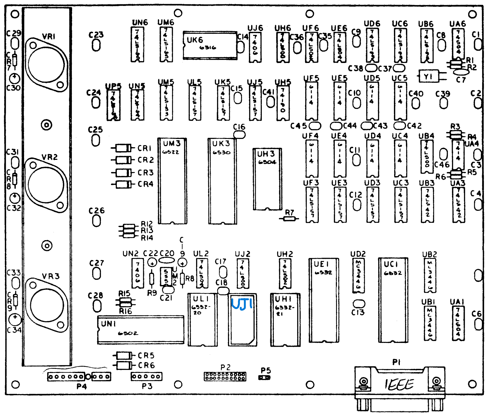

# 💾cbm-ieee-disk-diag-rom

🛠️ A diagnostic ROM for Commodore 2040, 3040, and 4040 disk drives which use the IEEE-488 interface.

Got a question?  See the [FAQ](./FAQ.md).

## 📖Overview

This project provides a diagnostics ROM for early Commodore disk drives (2040, 3040, and 4040). It performs memory and other tests and provides visual feedback through the drive's LEDs and, if functional, via the IEEE-488 port.

## ✨Features

- 📚 Compatible with multiple disk drive models, running both DOS 1 and 2
- ✅ Full zero page and static RAM testing
- 🔍 Identifies precisely which static RAM chip(s) have failed
- 💡 Visual status indication and failed components via drive LEDs
- 🆔 Detects and reports the configured hardware device ID (8, 9, etc)
- 🔌 Reports diagnostic results to computer if IEEE-488 is operational 
- 🖥️ Tests presence and functioning of secondary on-board CPU
- 🔀 Can be run as replacement for main ROM or alongside stock DOS 1 ROMs

## 📝Contents
- [📥Installation](#installation)
- [🚀Usage](#usage)
- [💡LED Indicators](#led-indicators)
- [📋Detailed Test Information](#detailed-test-information)
- [📊Detailed Result Information](#detailed-result-information)
- [🔌Reporting via IEEE-488](#reporting-via-ieee-488)
- [🔨Building From Source](#building-from-source)
- [📐Schematics and PCB Layouts](#schematics-and-pcb-layouts)
- [🗺️Memory Layout](#memory-layout)
- [🚧Future Enhancements](#future-enhancements)
- [❓FAQ](#faq)
- [🤓Fun Facts](#fun-facts)
- [📜License](#license)
- [🤝Contributing](#contributing)

## 📥Installation

Either [Build From Source](#building-from-source) or download the ROMs from the [releases page](https://github.com/piersfinlayson/cbm-ieee-disk-diag-rom/releases/).

1. 🔥 Burn the appropriate ROM image to an EPROM/EEPROM:
   - Use `ieee_diag_f000.bin` for installation at $F000
   - Use `ieee_diag_d000.bin` for installation at $D000

2. 🔌 Install the EPROM in the appropriate socket in your disk drive
   - $F000 - [UH1](#schematics-and-pcb-layouts)
   - $D000 - [UJ1](#schematics-and-pcb-layouts)

See [📐Schematics and PCB Layouts](#schematics-and-pcb-layouts) for the location of the components.

If you want to fill a larger PROM with this ROM image, see [`flash_fill_1mbit.sh`](flash_fill_1mbit.sh).  You may need to modify the script for your PROM size.

## 🚀Usage

After installing the ROM:

1. Power on the disk drive
2. The diagnostics will run automatically
3. Observe the LED pattern to determine the status - see [LED Indicators](#led-indicators)

To choose which ROM to install:

### 🔄$F000 ROM replacement, UH1

If you are unsure whether your upper, $F000, ROM, located at UH1 is functional, replace it with the $F000 version of this diagnostics ROM.

In particular, this is helpful if you have all three LEDs stay lit on your drive when booting with the original ROM.  If they remain lit with this ROM (assuming you correctly built, flashed and installed it) you have a non-ROM issue preventing the ROM code from being executed.  If this ROM runs, then one of your stock ROMs is probably faulty.

For a first test, you are best off removing the $E000 ROM (UL1) before running this diagnostics ROM at $F000, in case $E000/UL1 is faulty and causes address or data bus issues. 

### 🔄$D000 ROM, UJ1

If you believe your stock $F000 and $E000 ROMs are functional (the three LEDs go out after powering on), and your UJ1 socket is free, you can install the $D000 version of this ROM at location UJ1.  You need both $F000 and $E000 to boot far enough to load the ROM installed at $D000.  If you suspect either ROM of being faulty, start with the $F000 replacement method, above.

If your drive has a $D000 ROM already installed then your current ROMs likely don't not support a diagnostic ROM at $D000, so replace your $F000 with the $F000 version of this ROM instead.  This is typical of the 4040, although 2040 and 3040s may have been upgraded to a three ROM configuration.

DOS 1 firmware version 901468/06/07 come as a 2 ROM set and support at $D000 UJ1 diagnostics ROM being installed. 

DOS 2 firmware versions 901468-11/12/13 and 14/15/16 come as a 3 ROM set.

When running as the $D000 ROM the zero page test within this ROM is skipped - as the stock ROM has already done this test, and because it booted, that test passed.

## 💡LED Indicators

There are two distinct phases to the ROM's operation:
- [▶️ Running tests](#running-tests)
- [📊 Reporting results](#reporting-results)

### 🏃Running Tests

After boot and during this phase, the ERR LED is not used.  The other LEDs show the status of the testing - in order:

| LED Pattern | Meaning |
|-------------|---------|
| All LEDs including ERR on | [Device coming out of reset](#device-coming-out-of-reset) |
| All LEDs remain on | [Diagnostics ROM failed to run](#diagnostics-rom-failed-to-run) | 
| ERR LED goes out, followed by DR0/DR1 lights | [Testing zero page](#testing-zero-page) |
| Both drive lights blink on then off | [Completed a test, moving onto next](#️moving-to-next-test) |
| No visual indication | [Retrieving device ID](#retrieving-device-id) |
| Both drive lights blink on then off | [Completed a test, moving onto next](#️moving-to-next-test) |
| DR0 and DR1 flash alternately | [Static RAM Test #1](#static-ram-test) |
| Both drive lights blink on then off | [Completed a test, moving onto next](#️moving-to-next-test) |
| No visual indication | [Checking 6504 booted](#️checking-the-6504-booted) |
| Both drive lights blink on then off | [Completed a test, moving onto next](#️moving-to-next-test) |
| No visual indication | [Attempted to pause 6504](#️pausing-the-6504) |
| Both drive lights blink on then off | [Completed a test, moving onto next](#️moving-to-next-test) |
| DR0 and DR1 flash alternately | [Static RAM Test #2](#static-ram-test) |
| Both drive lights blink on then off | [Completed a test, moving onto next](#️moving-to-next-test) |

### 📢Reporting Results

After the above tests have run the drive goes through a reporting sequence, and repeats it forever:
- Report any zero page error with UC1
- Report any static RAM errors
- Report any 6504 errors
- Report any device ID

If you don't see the ERR LED coming on, and you see 8 flashes of the DR0/DR1 LEDs repeating, congratulations - the diagnostics ROM tests passes, and your device is configured as device 8.

Reporting uses the following patterns:

| LED Pattern | Meaning |
|-------------|---------|
| ERR and DR1 LEDs blinking fast | [UE1 zero page test failed](#ue1-zero-page-test-failed) |
| ERR on, 1-4 flashes on either DR1 or DR0 | [Static RAM check failed](#️static-ram-check-failed) |
| ERR on, 5 flashes on DR0 | [UC1 zero page test failed](#️uc1-zero-page-test-failed) |
| ERR on, 6 flashes on both DR1 and DR0 | [6504 failed to boot](#️6504-failed-to-boot) |
| ERR on, 7 flashes on both DR1 and DR0 | [Failed to pause 6504](#️failed-to-pause-6504) |
| ERR LED off, DR0/DR1 flashing | [Reporting Device ID](#reporting-device-id) |

## 📋Detailed Test Information

### 🔄Device coming out of reset

The drive tends to take around 1s to come out of reset and boot the 6502 after power on.  If installed at $F000 (UH1), the 6502 should immediately start running the diagnostics ROM code.  In turn, the first thing the diagnostics ROM does is turn off all LEDs, before moving on to the first test.

As the first test immediately turns the DR0 and DR1 LEDs back on, for zero page testing (which should be very quick), it may appear like the ERR light briefly went out, then the drive LEDs.

If the 3 LEDs all stay on, see [Diagnostics ROM failed to run](#diagnostics-rom-failed-to-run).

### 📄Testing Zero Page

The two drive LEDs are solidly lit while testing the zero page.  However, as this test is so brief, it may look like a very quick flash.  As the zero-page is tested immediately after boot, it will happening very soon after power on.

This may appear as if the ERR goes out, very shortly followed by the DR0 and DR1 LEDs.

The zero page test starts with the 128 bytes from UE1, and then tests the 128 bytes from UC1.  If the UE1 test fails you get either:
- ERR and DR1 LEDs blinking fast, if the UE1 works enough to control the LEDs
- all three LEDs remaining on (as the diagnostics ROM can't turn them off with a failed UE1).

### ⏭️Moving to next test

A brief blink of all three LEDs indicates that a test has been completed, and the ROM is moving onto the next test.  If there was no other indication between two of these indications, the test didn't explicitly provide any visual indication that it was running (this happens when getting the device ID).

### 🆔Retrieving Device ID

There is no visual indication when it happens and it is very fast - the ROM just reads the device ID lines PB0-2 attached to UE1.

### 🧪Static RAM Test

Two static RAM tests are performed:
- The first tests $1100-$13FF, $2000-$23FF, $3000-$33FF and $4000-43FF.
- THe second, which runs after checking the 6504 and attempting to take over control over it, tests $1000-$10FF.  This range, which shares the chips with $1100-$13FF, is used to communicate with the 6504, to take it over.  We try to take the 6504 over before testing this range, so we avoid crashing or confusing the 6504 by changing RAM from under it. 

The DR0 and DR1 LEDs illuminate during each page (256 byte) test, with the LED switching for each page of RAM is tested.
- For the first static RAM test you should see them blinking alternating back and forth, for a total of 15 illuminations.
- For the second, you will just set one of the LEDs (DR0) light, briefly.

The static RAM test is relatively straightforward.  Each byte is tested in turn with a variety of patterns.  If a failure is hit on both the upper nibble and lower nibble for an address in a particular bank, the remaining tests for that bank is skipped - as this demonstrates both RAM chips for that bank are faulty.  

### 🟡Checking the 6504 booted

Before testing RAM $1000-10FF, the diagnostics ROM checks the 6504 booted.  This is done by checking some shared RAM locations the 6504 should have written to - these are located in the $1000-$10FF range.  Of course, it is possible, as this RAM range hasn't been tested yet it isn't working - and we get a false positive - but we have checked the remaining 75% of the chips that make up this range if we perform this test, so it is highly likely the RAM is good.

If the 6504 appears not to have booted, the subsequent step [Pausing the 6504](#️pausing-the-6504) will be skipped.

### ⏸️Pausing the 6504

After checking the 6504 has booted, and still before testing RAM $1000-$10FF, the diagnostics ROM attemptes to pause the 6504.  The ROM will wait for up to 1s for a response from the 6504 that it has paused.  The drive 0 motor will very briefly spin if this test is successful.  (The reason for the brief spin, is that the 6504 stock ROM code will spin up the drive motor briefly when the 6502 asks it to execute a job - which is how the diagnostics ROM takes over the 6504.  It does this because it expects a job to involve reading or writing to the disk - for example, this is the mechanism that is used by the 6502 to format a disk.)

This test has the added benefit of checking that the 6504 is running, and behaving as expected, not just that it has booted - if the diagnostics ROM can take it over and pause it, the 6504 and its ROM (stored in the 6530 RRIOT UK3) are working.

We can also use this capability to add further 6504 tests in future, as we have full control over it if this test succeeds.

## 📊Detailed Result Information

Detailed results are reported via LED flash codes.  These results report in a loop, with all error results being reported sequentially followed by the device ID - and then the loop restarts.

Error results are distinguished by the ERR LED being lit.  The device ID is reported with the ERR LED off.

If the [diagnostics ROM failed to run](#diagnostics-rom-failed-to-run) or the [UE1 zero page test failed](#ue1-zero-page-test-failed) only that error will be reported - as other tests cannot be run.

If the drive proceeded beyond these tests and the first bank of static RAM (UC5/UC4) passed testing (which you can identify via [flash codes](#️static-ram-check-failed)), the drive will attempt to enable its IEEE-488 stack, enabling [reporting via IEEE-488](#reporting-via-ieee-488).  In this case it would be easier to retrieve diagnostics via IEEE-488 than via the LEDs.

### ❌Diagnostics ROM failed to run

In this scenario, all three LEDs will be lit.

Most likely 6502 is faulty so didn't boot, or this ROM is corrupted, or UE1 6532 is faulty and the zero page test of UE1 failed.  UE1 also controls the LEDs, so a faulty UE1 cannot be reported by the diagnostics ROM via the LEDs.

First of all try swaping your UE1 and UC1 chips around to see if the other 6532 RIOT chip works.  Next try replacing the 6502.

If the problem remains, you probably have an issue with either
- the main RESET circuit
- a failed 74LS157 (UC3/UD3/UE3/UF3) corrupting the address bus
- other corruption on either the 6502 address bus or shared data bus
- something else that is preventing proper communication between components, on the data or (6502) address buses.

As this diagnostics ROM requires address and data bus communication between the 6502, this ROM and the UE1 6532, corruption of these buses can cause issues this ROM cannot diagnose.  However, understanding this is useful to track the problem down.

### ❌UE1 zero page test failed

If, immediately after turning on the device, and the 3 lights going out you get a blinking ERR LED and DR1 LED, then the UE1 zero page RAM is bad, but the UE1 IO lines work (hence the ability to flash the LEDs).  This may indicate a bad connnection or trace associated with UE1 rather than a chip failure. 

### ⚠️UC1 zero page test failed

If the UC1 zero page test fails the diagnostic ROM can and will continue to run and report on all of its tests. 

This error is indicated at the reporting stage with the ERR LED on, and the DR0 LED flashig 5 times.

### ⚠️Static RAM check failed

In this scenario the ERR LED is lit while either the DR1 or DR0 LED flashes.  All LEDs go out after the flashing.  The combination of LED which is flashing and the number of flashes, identifies which chip the failed address is on:

| LED | Number of Flashes | Chip |
|-----|-------------------|------|
| DR0 | 1 | UC4 |
| DR0 | 2 | UD4 |
| DR0 | 3 | UE4 |
| DR0 | 4 | UF4 |
| DR1 | 1 | UC5 |
| DR1 | 2 | UD5 |
| DR1 | 3 | UE5 |
| DR1 | 4 | UF5 |

If you see failures across all of your chips, it may instead be one or more failed 74LS157s UC3/UD3/UE3/UF3 - as these multiplex the address lines from the 6502 and 6504 to the RAM chips.  Or, it may be a bus problem - try removing the 6504 (UH3), 6530 (UK3) and 6522 (UM3) from the board and re-running the test.  This isolates those chip as potentially conflicting with the shared data bus.  Of course, you will then get a 6504 error reported. 

### ⚠️6504 failed to boot

If this fails, it may be a 6504 failure, or a  problem with another chip on the 6504 address bus - for example the 6522 VIA UM3 or 6530 RRIOT UK3.  Or a problem with the shared RAM UC4 or UC5 (although unlikely if both static RAM tests passed).

It may also be a problem with the shared data bus.  As the data bus is shared between both the 6504 and 6502, be suspicious of a shared bug problem if, as well as a 6504 failure, you also get a [static RAM failure](#️static-ram-check-failed).

### ⚠️Failed to pause 6504

If this fails, it signifies either a 6504 failure, or possibly another component on the 6504 address bus - for example the 6522 VIA UM3 or 6530 RRIOT UK3.

It may also be a problem with the shared data bus.  As the data bus is shared between both the 6504 and 6502, be suspicious of a shared bug problem if, as well as a 6504 failure, you also get a [static RAM failure](#️static-ram-check-failed).

### 🆔Reporting Device ID

With the ERR LED off, the number of flashes, before pausing, indicates the hardware configured device ID of this drive (8-15)

## 🔌Reporting via IEEE-488

Once the diagnostics tests have been run, and flash codes are being used to [report diagnostics results](#detailed-result-information), the diagnostic ROM will start an IEEE-488 stack on the disk drive.  It can be connected to by an IEEE-488 controlled via the hardware configured hardware ID, which is [reported via flash codes](#reporting-device-id).

Assuming the drive's IEEE-488 hardware is functional, the drive can then be instructed to provide its configured information by settig it to talk on the appropriate channel.

An explanation of the various types of information follows.  While [📟 Last Operation Status](#last-operation-status) and [📋Channel Listing](#channel-listing) are available on the specified channels, information on other channels may vary depending on the ROM version.  Use the [📋Channel Listing](#channel-listing) to see what is available on each channel.

### 📟Last Operation Status

This is exposed on channel 15, and returns a status string like a stock Commodore disk drive.  The first time this is queried after the IEEE-488 has been initialized, a 73 error code will be reported, just like a newly booted stock Commodore disk drive.  Subsequently this will return either 00 (OK) or some other result based on the last operation the ROM performed in response to a user request.

Such requests aren't supported as of ROM version 0.1.5, hence you should expect 00,OK,00,00 after the intial 73 response.

To query this status on your PET (or C64 with IEEE-488 support), use the following program (you do not need to the REM statements).

```basic
1 REM OPENS CHANNEL 15 USING TALK
2 REM RECEIVES LAST OPERATION STATUS
3 REM READS UNTIL CARRIAGE RETURN
4 REM PRINTS AND EXITS
10 OPEN 1,8,15
20 INPUT#1,EN,EM$,ET,ES
30 PRINT EN;EM$;ET;ES
40 CLOSE 1
```

### 📋Channel Listing

When instructed to talk on channel 0, the drive will return a list of information available on specific channels.

A sample program to retrieve this information is provided here (you do not need the REM statements).

```basic
1 REM OPENS CHANNEL 0 USING TALK
2 REM READS CHANNEL LISTING DATA
3 REM READS UNTIL EOF IS REACHED
4 REM CONVERTS DATA CONVERTED TO ASCII
5 REM PRINTS IT AND EXITS 
10 OPEN 1,8,0
20 GET#1,A$
30 IF ST AND 64 THEN 60
40 PRINT ASC(A$+CHR$(0));
50 GOTO 20
60 CLOSE 1
```

This program can be used with a different channel number - change ```0``` to the appropriate number on line ```10```,

### 🚥Diagnostic Summary

A one-line summary of whether the drive passed all tests, or not.

### 📊Detailed Diagnostics Results

Detailed diagnostics results are reported, including whether UC1 failed the zero-page test and the location of any RAM chips that failed the RAM test. 

## 🔨Building From Source

### 📋Requirements

- `ca65` assembler (part of the cc65 suite)
- `make` (for building using the Makefile)

Install them both on linux like so:

```bash
sudo apt-get install cc65 make
```

### 🧰Compilation

```bash
# Compile for both possible ROM locations
make

# Or
make f000   # Builds the standaline version
make d000   # Builds the version to be installed alongside the stock DOS 1 ROMs
```

This produces two ROM images:
- `ieee_diag_f000.bin` - For installation at $F000
- `ieee_diag_d000.bin` - For installation at $D000


### 🏗️Build Process

The build process is two stage:
- First, the code which will be copied to the disk drive's secondary CPU, and which this ROM will cause to be executed, is compiled and linked.
- Second, the two variants of this ROM (one to be loaded at $F000, the other to be installed alongside the stock ROMs a $D000) are compiled.  At this point, the secondary CPU's binary is included.  These two ROM variants are then linked producing the binaries.

An optional script [`flash_fill_1mbit.sh`](flash_fill_1mbit.sh) can then be run to copy one of the produced ROMs ($F000 or $D000) to be copied multiple times to be a single 1Mbit file.  This can then be used to fill a 1 Mbit PROM.  If you have a different sized PROM, you can modify the script to product an appropriate sized file.

## 📐Schematics and PCB Layouts

See [📐Schematics and PCB Layouts](./docs/schematics/README.md) for Commdore IEEE-488 schematics and PCB layout diagrams.

The 4040 PCB layout is reproduced here to aid with identifying the components this document references:



## 🗺️Memory Layout

See [🗺️Memory Layout](./docs/technical/4040-memory-layout.md) for a detailed memory layout of the 6502 and 6504 processors, including the address space and the components which are mapped to each address.

## ❓Frequently Asked Questions

See [❓FAQ](./FAQ.md) for a list of frequently asked questions.

## 🚧Future Enhancements

This section lists some potential future enhancements:

🔌 Explicitly test each IEEE-488 line prior to enabling IEEE-488 support.  See [docs/specs/IEEE-test.md](docs/specs/IEEE-test.md) for a proposal.

📡 Ability to send diagnostics information via IEEE-488 port using a serial protocol and just lines available on UE1 - to get around issues with UC1.

🧠 Additional 6504 and supporting component tests.

💽 Test drive mechanisms, which are driven via the 6504.

👂 Allow drive tests to be manually driven via IEEE-488 LISTEN commands.  See [docs/specs/LISTEN-commands.md](docs/specs/LISTEN-commands.md) for a proposal.

📈 Support other drives, including 8050 and 8250.

## 🤓Fun Facts

### 🦄Official Commodore Diagnostic ROM 

It appears, from the fact that the stock DOS 1 ROMs support a $D000 diagnostics ROM, that there was an official Commodore diagnostics ROM which could be installed alongside the main DOS 1 ROMs to aid with problem diagnosis.  I've not been able to find a copy of that ROM, hence building my own to help me fix 2040, 3040 and 4040 drives.

### 🤔Upgrading 2040 to DOS 2

In "Programming the PET/CBM", author Raeto states that the 2040 is difficult to upgrade as the PCB needs to be changed - the implication being to upgrade the ROMs.  I've not seen evidence of this - my 2040 and 3040 DOS 1 drives are very similar (the only hardware difference appears to be the addition of a double NOT gate on some of the clock lines presumably to clear up the signal), so I believe it would be perfectly possible to upgrade my 2040 to DOS 2 just by upgrading the ROMs.  It is possible there were earlier 2040s with a different PCB, although mine dates from 1978-9.  It does have some bodge wires, which look factory installed, so perhaps there was an earlier, un-bodged, version.

## 📜License

Licensed under the MIT License.  See [LICENSE](LICENSE).

## 🤝Contributing

Contributions are welcome.  Please feel free to submit a Pull Request.
